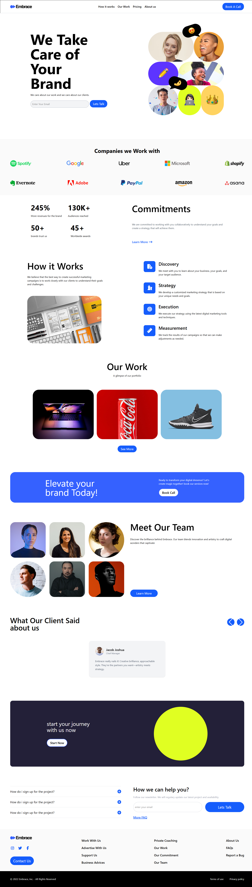

# Marketing Agency Landing Page

A fully responsive **Marketing Agency Landing Page** built using **HTML5** and **Tailwind CSS**. This landing page is designed to showcase your agency's services, portfolio, and company information in a modern and mobile-friendly layout.

---

## 🔹 Features

- **Fully Responsive:** Works seamlessly on desktop, tablet, and mobile devices.
- **Main Sections Included:**
  - **Hero Section:** Eye-catching introduction with a call-to-action.
  - **How It Works:** Step-by-step explanation of your services.
  - **Our Work:** Showcase previous projects with images and descriptions.
  - **About Us:** Highlight the agency's mission, vision, and team.
  - **Contact / Footer:** Get in touch section with social media links.
- **Modern Design:** Built using Tailwind CSS for fast and customizable styling.
- **Clean Code:** Semantic HTML5 structure for SEO and accessibility.

---

## 🔹 Technologies Used

- **HTML5** – Semantic and structured markup.
- **Tailwind CSS** – Utility-first CSS framework for fast styling and responsive design.

---

## 🔹 Screenshot

;

---

## 🔹 Live Demo

<a href="https://marketing-agencty-page.netlify.app/">live demo</a>

